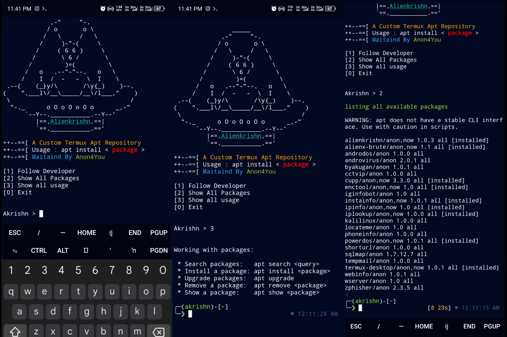

# alienkrishn
Custom termux apt repository Maintained by me
#     screenshots 


## About
It's a custom termux repository which contains some tools and packages not available in termux offical repo

## Usage 
You can install any package from this repo using apt or pkg
## Example
```
apt install package_name -y
```
## Add repo in your termux
* [click here](https://github.com/Anon4You/alienkrishn/blob/main/INSTALL.md) 


